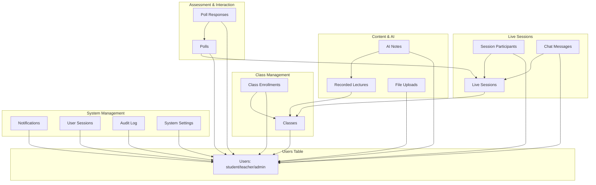

# 🔗 Learn-X: Student-Teacher-Admin Interconnections Analysis

## 📋 **OVERVIEW**

This document provides a comprehensive analysis of how Students, Teachers, and Admins interact within the Learn-X platform, including database relationships, API endpoints, feature access, and workflow connections.

---

## 🏗️ **DATABASE RELATIONSHIP MAPPING**

### **Core User Relationships**



---

## 👥 **ROLE-BASED FEATURE ACCESS MATRIX**

| **Feature Category** | **Student** | **Teacher** | **Admin** | **Interconnection Type** |
|---------------------|-------------|-------------|-----------|-------------------------|
| **Authentication & Profile** |
| Register/Login | ✅ Create | ✅ Create | ✅ Create | **Independent** - All roles equal access |
| Profile Management | ✅ Own | ✅ Own | ✅ All Users | **Hierarchical** - Admin > Teacher/Student |
| Session Management | ✅ Own | ✅ Own | ✅ Monitor All | **Hierarchical** - Admin monitors all |
| **Class Management** |
| Class Creation | ❌ | ✅ Create | ✅ Approve/Override | **Approval Chain** - Teacher → Admin |
| Class Enrollment | ✅ Request | ✅ Approve | ✅ Manage | **Request-Approval** - Student → Teacher → Admin |
| Class Modification | ❌ | ✅ Own Classes | ✅ All Classes | **Ownership** - Teacher owns, Admin overrides |
| **Live Sessions** |
| Start Session | ❌ | ✅ Host | ✅ Monitor | **Host-Participant** - Teacher hosts, others join |
| Join Session | ✅ Participate | ✅ Host/Moderate | ✅ Monitor | **Participation** - All can join with different roles |
| Session Control | ��� | ✅ Full Control | ✅ Override | **Control Hierarchy** - Teacher controls, Admin overrides |
| Recording Control | ❌ | ✅ Start/Stop | ✅ Manage All | **Content Control** - Teacher creates, Admin manages |
| **Communication** |
| Chat Messages | ✅ Send/Receive | ✅ Send/Moderate | ✅ Monitor/Moderate | **Moderation Chain** - Student → Teacher → Admin |
| Notifications | ✅ Receive | ✅ Send to Class | ✅ Send System-wide | **Broadcast Hierarchy** - Admin > Teacher > Student |
| Translation | ✅ Use | ✅ Enable/Control | ✅ System Config | **Feature Control** - Teacher enables, Admin configures |
| **Content & Learning** |
| View Materials | ✅ Enrolled Classes | ✅ Own Classes | ✅ All Content | **Access Hierarchy** - Based on enrollment/ownership |
| Upload Materials | ❌ | ✅ To Own Classes | ✅ System-wide | **Content Creation** - Teacher creates, Admin manages |
| AI Notes Generation | ✅ Own Notes | ✅ Class Content | ✅ All Content | **Content Processing** - Based on access rights |
| Recorded Lectures | ✅ View Enrolled | ✅ Create/Manage Own | ✅ Manage All | **Content Ownership** - Teacher owns, Admin controls |
| **Assessment & Interaction** |
| Create Polls/Quizzes | ❌ | ✅ In Sessions | ✅ System-wide | **Assessment Control** - Teacher creates, Admin oversees |
| Respond to Polls | ✅ Participate | ✅ View Results | ✅ Analyze All | **Response Chain** - Student responds, Teacher/Admin analyze |
| Breakout Rooms | ✅ Join | ✅ Create/Manage | ✅ Monitor | **Room Management** - Teacher manages, Admin monitors |
| **System Administration** |
| User Management | ❌ | ❌ | ✅ Full Control | **Administrative** - Admin only |
| System Settings | ❌ | ❌ | ✅ Configure | **Administrative** - Admin only |
| Audit Logs | ❌ | ❌ | ✅ View All | **Security** - Admin only |
| Health Monitoring | ❌ | ❌ | ✅ System Health | **Monitoring** - Admin only |

---

## 🔄 **WORKFLOW INTERCONNECTIONS**

### **1. Class Lifecycle Workflow**

```
TEACHER                    STUDENT                    ADMIN
   │                          │                         │
   ├─ Create Class ──────────→ │                         │
   │                          │                         │
   │                          ├─ Request Enrollment ──→ │
   │                          │                         │
   ├─ Approve Enrollment ←──── │                         │
   │                          │                         │
   ├─ Schedule Session ──────→ │                         │
   │                          │                         │
   ├─ Start Live Session ────→ ├─ Join Session           │
   │                          │                         │
   ├─ Manage Session ────────→ ├─ Participate            ├─ Monitor
   │                          │                         │
   ├─ End Session ──────────→ │                         │
   │                          │                         │
   ├─ Generate Recording ───→ ├─ Access Recording       ├─ Manage All
```

### **2. Content Creation & AI Processing Workflow**

```
TEACHER                    STUDENT                    ADMIN
   │                          │                         │
   ├─ Upload Video ─────────→ │                         │
   │                          │                         │
   ├─ Process with AI ──────→ │                         │
   │                          │                         │
   ├─ Generate Notes ───────→ ├─ Access AI Notes        ├─ Monitor Processing
   │                          │                         │
   ├─ Share with Class ────→ ├─ Study Materials        ├─ Content Oversight
   │                          │                         │
   ├─ Create Assignments ──→ ├─ Submit Work            ├─ Grade Oversight
   │                          │                         │
   ├─ Provide Feedback ────→ ├─ Receive Feedback       ├─ Quality Control
```

### **3. Communication & Interaction Workflow**

```
STUDENT                    TEACHER                    ADMIN
   │                          │                         │
   ├─ Send Chat Message ────→ ├─ Moderate Chat          ├─ Monitor All
   │                          │                         │
   ├─ Ask Question ─────────→ ├─ Answer/Clarify         │
   │                          │                         │
   ├─ Respond to Poll ──────→ ├─ View Results           ├─ Analyze Trends
   │                          │                         │
   ├─ Join Breakout Room ──→ ├─ Manage Rooms           ├─ Oversee Sessions
   │                          │                         │
   ├─ Request Help ────────→ ├─ Provide Support        ├─ Escalation Support
```

---

## 🗄️ **DATABASE INTERCONNECTION DETAILS**

### **Primary Relationships**

1. **Users → Classes**
   - `classes.teacher_id` → `users.id` (Teacher owns class)
   - **Interaction**: Teacher creates and manages classes

2. **Users → Class Enrollments**
   - `class_enrollments.student_id` → `users.id` (Student enrollment)
   - `class_enrollments.class_id` → `classes.id` (Class reference)
   - **Interaction**: Student enrolls in teacher's class

3. **Classes → Live Sessions**
   - `live_sessions.class_id` → `classes.id` (Session belongs to class)
   - **Interaction**: Teacher starts session for their class

4. **Users → Session Participants**
   - `session_participants.user_id` → `users.id` (User in session)
   - `session_participants.session_id` → `live_sessions.id` (Session reference)
   - **Interaction**: Students and teachers join sessions

5. **Users → Chat Messages**
   - `chat_messages.user_id` → `users.id` (Message sender)
   - `chat_messages.session_id` → `live_sessions.id` (Session context)
   - **Interaction**: All users can chat in sessions

6. **Users → AI Notes**
   - `ai_notes.user_id` → `users.id` (Note owner)
   - `ai_notes.lecture_id` → `recorded_lectures.id` (Content reference)
   - **Interaction**: Users generate notes from content

### **Secondary Relationships**

1. **Polls & Responses**
   - Teacher creates polls → Students respond → Admin analyzes
   - `polls.teacher_id` → `users.id`
   - `poll_responses.user_id` → `users.id`

2. **File Uploads**
   - All users can upload → Admin manages storage
   - `file_uploads.user_id` → `users.id`

3. **Notifications**
   - System sends to users → Teachers send to classes → Admin sends system-wide
   - `notifications.user_id` → `users.id`

4. **Audit Logging**
   - All user actions logged → Admin reviews
   - `audit_log.user_id` → `users.id`

---

## 🔌 **API ENDPOINT INTERCONNECTIONS**

### **Authentication Flow**
```
POST /api/auth/register → All roles can register
POST /api/auth/login → All roles authenticate
GET /api/user/profile → Users access own profile
POST /api/user/profile → Users update own profile
```

### **Class Management Flow**
```
Teacher: POST /api/classes → Create class
Student: POST /api/user/enroll → Request enrollment
Teacher: GET /api/user/class/:id/students → View enrolled students
Admin: GET /api/classes → View all classes
```

### **Live Session Flow**
```
Teacher: POST /api/live/start → Start session
Student: POST /api/live/join/:sessionId → Join session
All: GET /api/live/:sessionId/messages → View chat
Teacher: POST /api/live/:sessionId/recording/start → Start recording
Admin: GET /api/live/active → Monitor all sessions
```

### **Content & AI Flow**
```
Teacher: POST /api/lectures/upload-video → Upload content
System: POST /api/ai-notes/generate/:lectureId → Process with AI
Student: GET /api/ai-notes → Access generated notes
Admin: GET /api/lectures/my-lectures → Manage all content
```

---

## 🎯 **PERMISSION & ACCESS CONTROL**

### **Role Hierarchy**
```
ADMIN (Highest Authority)
├── Full system access
├── Override all permissions
├── Manage users and settings
├── Monitor all activities
└── System configuration

TEACHER (Content Creator)
├── Create and manage classes
├── Control live sessions
├── Upload and manage content
├── Moderate student interactions
└── Generate assessments

STUDENT (Content Consumer)
├── Enroll in classes
├── Participate in sessions
├── Access learning materials
├── Submit assignments
└── Generate personal notes
```

### **Access Control Matrix**

| **Resource** | **Student** | **Teacher** | **Admin** |
|-------------|-------------|-------------|-----------|
| Own Profile | Read/Write | Read/Write | Read/Write/Delete |
| Other Profiles | Read (limited) | Read (students only) | Full Access |
| Classes | Read (enrolled) | Read/Write (own) | Full Access |
| Live Sessions | Join (enrolled) | Create/Manage (own) | Monitor All |
| Content | View (enrolled) | Create/Manage (own) | Full Access |
| System Settings | None | None | Full Access |
| Audit Logs | None | None | Read Only |

---

## 🔄 **REAL-TIME INTERCONNECTIONS**

### **WebSocket Events**

1. **Session Management**
   ```
   Teacher: 'start-session' → Students: 'session-started'
   Student: 'join-session' → Teacher: 'user-joined'
   Teacher: 'end-session' → Students: 'session-ended'
   ```

2. **Communication**
   ```
   Any User: 'chat-message' → All Participants: 'new-message'
   Teacher: 'start-poll' → Students: 'poll-created'
   Student: 'poll-response' → Teacher: 'response-received'
   ```

3. **Content Sharing**
   ```
   Teacher: 'share-screen' → Students: 'screen-shared'
   Teacher: 'upload-file' → Students: 'file-available'
   System: 'ai-processing' → Users: 'content-ready'
   ```

---

## 📊 **INTERACTION STATISTICS & MONITORING**

### **Trackable Interactions**

1. **Student-Teacher Interactions**
   - Class enrollments
   - Session participation
   - Chat messages
   - Poll responses
   - Assignment submissions

2. **Teacher-Admin Interactions**
   - Class creation requests
   - Content upload approvals
   - System resource usage
   - Performance metrics

3. **System-Wide Interactions**
   - Login/logout events
   - Feature usage statistics
   - Error rates and issues
   - Performance bottlenecks

### **Monitoring Endpoints**
```
GET /api/system/health → Overall system status
GET /api/teacher/stats → Teacher performance metrics
GET /api/user/dashboard → User activity summary
GET /api/admin/analytics → System-wide analytics
```

---

## 🛡️ **SECURITY & PRIVACY INTERCONNECTIONS**

### **Data Protection Flow**
```
User Data → Encryption → Database Storage
↓
Access Control → Role Verification → Permission Check
↓
Audit Logging → Security Monitoring → Admin Review
```

### **Privacy Levels**
1. **Public**: System information, public classes
2. **Class-Level**: Enrolled students and teacher
3. **Session-Level**: Active participants only
4. **Private**: Individual user data
5. **Administrative**: System logs and settings

---

## 🚀 **SCALABILITY CONSIDERATIONS**

### **Horizontal Scaling Points**
1. **User Management**: Separate service for authentication
2. **Content Processing**: Dedicated AI processing nodes
3. **Live Sessions**: WebRTC scaling with media servers
4. **File Storage**: CDN integration for content delivery
5. **Database**: Read replicas for different user types

### **Load Distribution**
- **Students**: High read, low write operations
- **Teachers**: Moderate read/write, content creation
- **Admins**: Low frequency, high privilege operations

---

## 📈 **FUTURE INTERCONNECTION ENHANCEMENTS**

### **Planned Features**
1. **Advanced Analytics**: Cross-role performance insights
2. **AI Recommendations**: Personalized learning paths
3. **Integration APIs**: Third-party system connections
4. **Mobile Synchronization**: Cross-device user experience
5. **Advanced Permissions**: Fine-grained access control

### **Scalability Roadmap**
1. **Microservices**: Separate services per role type
2. **Event-Driven Architecture**: Async communication
3. **Caching Layers**: Role-based cache strategies
4. **Load Balancing**: User-type aware routing
5. **Global Distribution**: Multi-region deployment

---

## 🎯 **SUMMARY**

The Learn-X platform implements a sophisticated three-tier role system with clear hierarchical relationships and well-defined interconnections:

- **Students** consume content and participate in learning activities
- **Teachers** create content and manage learning experiences  
- **Admins** oversee the entire system and ensure smooth operations

Each role has specific permissions and capabilities that create a seamless educational ecosystem with proper checks, balances, and oversight mechanisms.

The system is designed for scalability, security, and optimal user experience across all role types while maintaining clear separation of concerns and appropriate access controls.